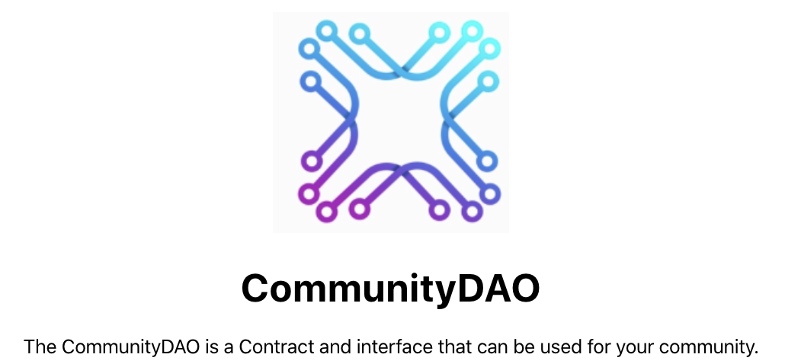
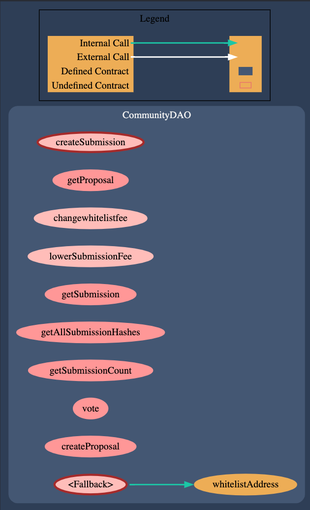

# CommunityDAO

CommunityDAO is a simple DAO for organizing community ideas.

- [CommunityDAO](#communitydao)
  - [Introduction](#introduction)
  - [High-level Solution](#high-level-solution)
  - [Installation](#installation)
    - [Installation of the DApp](#installation-of-the-dapp)
    - [Installation of the DApp (production build)](#installation-of-the-dapp-production-build)
    - [Deployment to Rinkeby](#deployment-to-rinkeby)
  - [Enhancements](#enhancements)
  - [Project Specifications](#project-specifications)
  - [Project Requirements](#project-requirements)
    - [User Interface](#user-interface)
    - [Testing](#testing)
    - [Design Patterns](#design-patterns)
    - [Security Tools / Common Attacks](#security-tools--common-attacks)
    - [Use a Library or Extend a Contract](#use-a-library-or-extend-a-contract)
    - [Deployment](#deployment)
    - [Stretch](#stretch)

A video demo is here: https://youtu.be/z2wVtiyzw_U

## Introduction

**CommunityDAO** is a standalone smart contract that can be used to run a simple Decentralized Autonomour Organization for a community of people.

It is written in [Solidity](https://solidity.readthedocs.io/en/v0.5.3/index.html) and compiled using `solc` version [0.5.3](https://github.com/ethereum/solidity/releases/tag/v0.5.3).

It can be deployed to an [Ethereum](https://ethereum.org) blockchain, be it the public [mainnet](https://etherscan.io), a public testnet like [Rinkeby](https://rinkeby.etherscan.io), a private blockchain, or on a local development blockchain like [Ganache](https://truffleframework.com/ganache).

It uses Ethereum's native [Ether](https://www.ethereum.org/ether) for and fees and payments required.

**CommunityDAO** was developed as [my](https://github.com/kayuzee) final project for the [ConsenSys Academy Developer Program Bootcamp](https://consensys.net/academy/bootcamp).

## High-level Solution

The **Community** contract manages a few entities:

- **Whitelist** - A foundation of the community. The original owner can whitelist members by adding their address and paying a feee of 0.01 ETH

- **Submissions** - This allows amy community member to submit a series of ideas e.g 'We need to have a new garden'

- **Proposals** - These ideas can be taken by anyone, and put forth as a proposal to the community

- **Vote** The vote mechanism allows community members to vote for a proposal within an alloted time.

- The owner can change fees, and the required times for voting

The diagram below depicts the contract and its functions. It uses the Safe Math and Ownable libraries from OpenZepplin.

Here is a sample screenshot:

## Installation

The source code of CommunityDAO can be found on [Github](https://github.com/kayuzee/communitydao)

1. The following instructions assume that you are using a *nix-like OS (e.g. Linux, macOS etc.) from its command-line and that Git is already installed.
2. Download and install the latest Node.js release for your OS according to the instructions found at https://nodejs.org. Avoid installing Node.js with sudo in order to avoid priviledge issues later on when installing packages and dependencies. On macOS, preferrably install it using the Homebrew package manager found on https://brew.sh.
3. Install Truffle.

   * For more information, follow the instructions found at https://truffleframework.com/docs/truffle/getting-started/installation.  
`$ npm install truffle -g`
4. Install Ganache CLI.

   * For more information, follow the instructions found at https://truffleframework.com/docs/ganache/quickstart.
`$ npm install ganache-cli -g`
5. Go to a directory of your preference in your computer (e.g. ~/Desktop).
6. Download or clone the CommunityDAO repo to your computer.
7. Go to the new directory.
8. `$ cd communitydao
9. The file structure will be like this:
.
+-- _app
|   +-- build
|   +-- public
|   +-- src
+-- _contracts
+-- _migrations
|   +-- test 

10. Install packages
`$ npm install'
11. Run Truffle Develop
`$ truffle develop'
  A list of accounts will be created and test network launched
12. In the Truffle Development Console compile the contracts
`truffle(develop)> compile`
13. Migrate the contracts
`truffle(develop)> migrate`
14. In a SEPERATE terminal window in the same directory go to the app folder
`$ cd app`
15. Run the React app
`npm run start'
The app will be running at http://localhost:3000/

### Installation of the DApp (production build)

TO DO

### Deployment to Rinkeby

- Contract is deployed to Rinkeby at 0x45fddc4cde82bf91d8bf24e027713f0bddf71886

## Enhancements

A list of possible enhancements for this contract are:

- Allow for hex to string conversions for ease of use
- Drizzle toast for events that are fired
- Coverting the proposals into a table with time stamps, time remaining and votes
- Creating a factory contract that allows communities to create their own DAOs without cloning a repo

---

## Project Specifications

- [x] A README.md that explains the project
  - [x] What does it do?
  - [x] How to set it up.
    - [x] How to run a local development server.
- [x] It should be a [Truffle project](https://truffleframework.com/docs/truffle/getting-started/creating-a-project).
  - [x] All contracts should be in a `contracts` directory.
    - [x] `truffle compile` should successfully compile contracts.
  - [x] Migration contract and migration scripts should work.
    - [x] `truffle migrate` should successfully migrate contracts to a locally running `ganache-cli` test blockchain on port `8454`.
  - [x] All tests should be in a `tests` directory.
    - [x] `truffle test` should migrate contracts and run the tests.
- [x] Smart contract code should be commented according to the [specs in the documentation](https://solidity.readthedocs.io/en/v0.5.2/layout-of-source-files.html#comments).
- [x] Create at least 5 tests for each smart contract.
  - [x] Write a sentence or two explaining what the tests are covering, and explain why those tests were written.
- [x] A development server to serve the front-end interface of the application.
  - [x] It can be something as simple as the [lite-server](https://www.npmjs.com/package/lite-server) used in the [Truffle Pet Shop tutorial](https://truffleframework.com/tutorials/pet-shop).
- [x] A document [design_pattern_decisions.md](design_pattern_decisions.md) that explains the design patterns chosen.
- [x] A document [avoiding_common_attacks.md](avoiding_common_attacks.md) that explains what measures were taken to ensure that the contracts are not susceptible to common attacks.
- [ ] Implement/use a library or an EthPM package.
  - [ ] If the project does not require a library or an EthPM package, demonstrate how it would do that in a contract called `LibraryDemo.sol`.
- [ ] Develop your application and run the other projects during evaluation in a VirtualBox VM running Ubuntu 16.04 to reduce the chances of runtime environment variables.

---

## Project Requirements

### User Interface

- [x] Run the dapp on a development server locally for testing and grading.
- [x] You should be able to visit a URL and interact with the application:
  - [x] App recognizes current account;
  - [x] Sign transactions using MetaMask or uPort;
  - [x] Contract state is updated;
  - [x] Update reflected in UI.

### Testing

- [x] Write 5 tests for each contract you wrote;
  - [x] Solidity **or** JavaScript.
- [x] Explain why you wrote those tests;
  - [x] Tests run with `truffle test`.

### Design Patterns

- [ ] Implement a circuit breaker (emergency stop) pattern.
- [x] What other design patterns have you used / not used?
  - [x] Why did you choose the patterns that you did?
  - [ ] Why not others?

### Security Tools / Common Attacks

- [x] Explain what measures you have taken to ensure that your contracts are not susceptible to common attacks.

### Use a Library or Extend a Contract

- [ ] Via EthPM or write your own.

### Deployment

- [x] Deploy your application onto one of the test networks.
- [x] Include a document called [deployed_addresses.txt](deployed_addresses.txt) that describes where your contracts live (which testnet and address).
- [x] Students can verify their source code using Etherscan https://etherscan.io/verifyContract for the appropriate testnet.
- [x] Evaluators can check by getting the provided contract ABI and calling a function on the deployed contract at https://www.myetherwallet.com/#contracts or checking the verification on Etherscan.

### Stretch

- [ ] Implement an upgradable design pattern.
- [ ] Write a smart contract in LLL or Vyper.
- [ ] Integrate with an additional service. For example:
  - [ ] IPFS - users can dynamically upload documents to IPFS that are referenced via their smart contract.
  - [ ] uPort
  - [ ] Ethereum Name Service - a name registered on the ENS resolves to the contract, verifiable on `https://rinkeby.etherscan.io/<contract_name>`
  - [ ] Oracle
